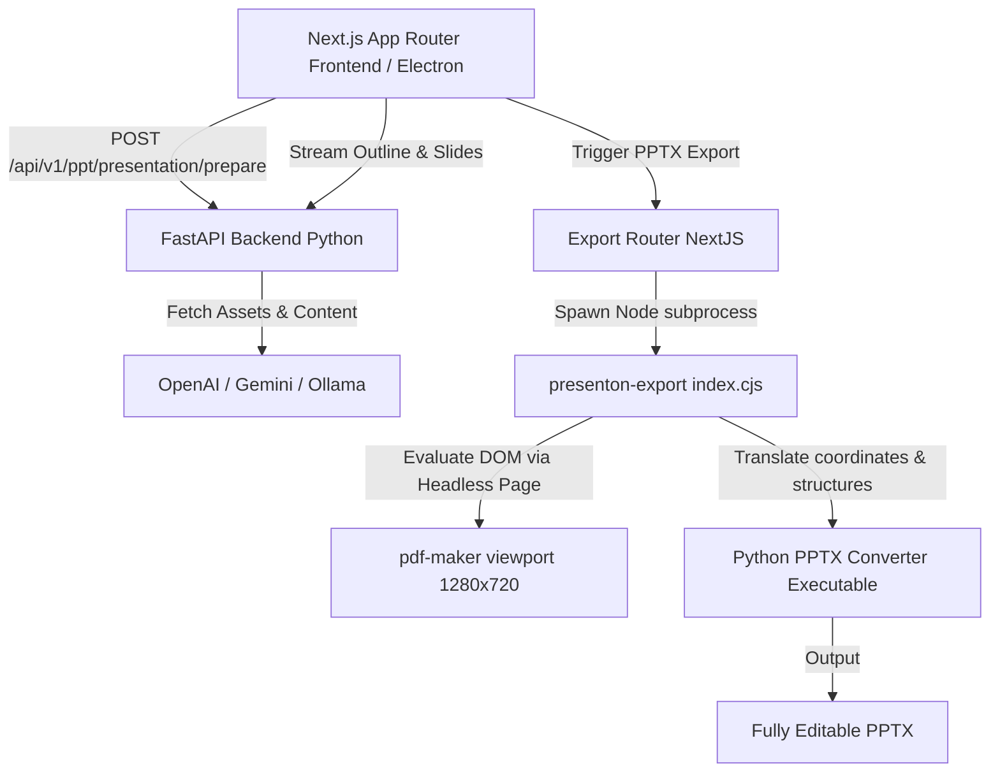

# Presenton Architectural Analysis & Recommendations Report

An in-depth review of the **Presenton** open-source AI Presentation Generator (Apache 2.0) to extract architectural patterns, state management models, and design strategies for **Mentor AI v2's Presentation Architecture v2.0**.

---

## 1. Core Architecture & Tech Stack

Presenton operates as an **API-first, hybrid desktop/cloud application** designed for self-hosting and maximum model control.



### Components Deconstruction
1. **Frontend (`servers/nextjs`)**: Built using the Next.js App Router, Tailwind CSS, Redux, and custom CSS viewport containers.
2. **Backend (`servers/fastapi`)**: A FastAPI Python backend handling file parsing (Markdown decomposition), database models (SQLite/MySQL/PostgreSQL), memory stores (Mem0), and LLM integrations.
3. **Export Engine (`presentation-export`)**: A bundled Node.js script (`index.cjs`) combined with a platform-specific compiled PyInstaller Python converter (`convert-linux-x64` / `convert.exe`).

---

## 2. The Presentation Generation Pipeline

Presenton splits the slide deck creation process into three distinct, decoupled phases to maximize generation speed and layout reliability.

### Phase 1: Upload & Decompose
- Files are parsed and converted into clean Markdown chunks.
- The outline endpoint streams out the high-level outline slide-by-slide.

### Phase 2: Layout Preparation (Decoupled Orchestration)
- Endpoint: `/api/v1/ppt/presentation/prepare`
- **What it does**: Accepts the user's outline, evaluates the context, and pre-selects specific layouts/templates for every slide *prior to content filling*.
- **Learning**: This exactly validates our **Phase 1: Deck Orchestration** blueprint in Mentor AI's v2.0 plan. Decoupling the "layout selector" from "slot generator" is the industry standard for avoiding layout breakage and AI confusion.

### Phase 3: Slide Generation & Streaming
- Endpoint: `/api/v1/ppt/presentation/stream`
- Generates text and slide content fitting into Zod-defined slot structures, streaming the presentation back to the frontend live.

---

## 3. High-Fidelity Editable PPTX & PDF Export Engine

The crowning achievement of Presenton is its fully editable PPTX export, which avoids "flat image screenshotting" and produces standard Microsoft PowerPoint shapes.

### Step 1: The Headless Viewport (`/pdf-maker`)
Presenton contains a dedicated export view page in NextJS under `/pdf-maker?id={presentationId}`. 
- The viewport is strictly locked at standard **16:9 HD dimensions (`1280px` width by `720px` height)**.
- Overflow and scroll behaviors are stripped entirely:
  ```css
  #presentation-slides-wrapper .main-slide {
    width: 1280px !important;
    max-width: 1280px !important;
    height: 720px !important;
    max-height: 720px !important;
    overflow: hidden !important;
  }
  ```

### Step 2: The HTML-to-Shape Parser (Bridge)
- The backend spawns the `presentation-export` Node tool (`index.cjs`).
- The tool boots up a headless browser, renders the `/pdf-maker` viewport, and parses the DOM.
- It calculates the absolute coordinates, typography weights, text content, image nodes, and charts.

### Step 3: Python-pptx Compilation
- The Node script packages this structured coordinate layout and feeds it to the **Python Converter Executable** (built using the standard `python-pptx` library packaged with PyInstaller).
- The Python executable programmatically constructs the shapes, inserts text boxes with calculated dimensions, and exports a **100% native, fully editable PPTX deck** that mirrors the HTML layout.
- PDFs are generated similarly by calling the page's print function under Puppeteer with custom margins and dimensions matching `@media print { size: 1280px 720px; }`.

---

## 4. Theme & Custom Styling Strategy

Presenton maintains design continuity across all layout variations by translating custom brand themes into highly predictable CSS custom properties.

### 1. Unified CSS Variable Bridge
When a theme is applied to a slide wrapper, it sets CSS custom properties at the container boundary:
```typescript
const cssVariables = {
  "--primary-color": theme.data.colors["primary"],
  "--background-color": theme.data.colors["background"],
  "--card-color": theme.data.colors["card"],
  "--stroke": theme.data.colors["stroke"],
  "--primary-text": theme.data.colors["primary_text"],
  "--background-text": theme.data.colors["background_text"],
  "--graph-0": theme.data.colors["graph_0"],
  "--graph-1": theme.data.colors["graph_1"],
  "--graph-2": theme.data.colors["graph_2"],
  ...
};
```
- Fonts are loaded on-the-fly via a custom utility (`useFontLoader`), injecting font faces into the document head and updating the family values dynamically.

### 2. Theme-Aware Chart Fills
- Presenton's data charts are styled using CSS custom properties (`var(--graph-0)`, `var(--graph-1)`).
- **Learning**: This ensures charts seamlessly adjust their colors during theme changes (light to dark mode switching) without requiring layout re-rendering or risking low-contrast/unreadable data charts.

---

## 5. Architectural Recommendations for Mentor AI v2

Based on Presenton's open-source architecture, we can refine our **Presentation Architecture v2.0** with specific technical upgrades:

### 🌟 Recommendation 1: Dedicated Export Viewport (`/presentation-export`)
- **Action**: Implement a clean, headerless, padding-free route under `app/(export)/presentation-export/page.tsx` strictly locked to `1280x720`.
- **Rationale**: Having a dedicated viewport ensures that export scripts (Puppeteer/Playwright) can print/screenshot slides without UI sidebars, menus, or canvas scaling issues.

### 🌟 Recommendation 2: Theme CSS Custom Properties
- **Action**: Convert our theme definitions inside `themes.ts` to export raw hex values that are mapped directly to CSS variables at the slide deck container.
- **Rationale**: This decouples theme styles from slide component markup. Slide layouts just use Tailwind classes containing theme variables (e.g., `bg-[var(--card-color)]`, `text-[var(--primary-text)]`), allowing instant, bug-free swapping of themes.

### 🌟 Recommendation 3: Theme-Aware SVG Charts
- **Action**: Refactor our Recharts/SVG components to use CSS variable strokes and fills:
  ```tsx
  <Bar dataKey="value" fill="var(--graph-0)" stroke="var(--stroke)" />
  ```
- **Rationale**: Eliminates chart visibility issues on dark themes. The charts inherit the theme variables dynamically.

### 🌟 Recommendation 4: Draggable Splits Coordinate Preservation
- **Action**: Preserve our draggable splits layout proportions as standard percentages (e.g. `layoutPercentages: [45, 55]`) inside each slide's metadata in Zustand.
- **Rationale**: Programmatic percentages translate perfectly to CSS Flex/Grid (`flex-basis: 45%`) in print/view mode and allow the HTML-to-PPTX parser to draw PowerPoint columns accurately.
