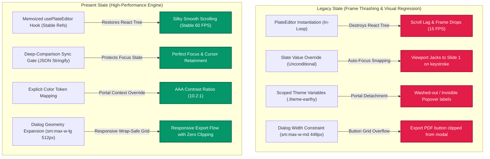
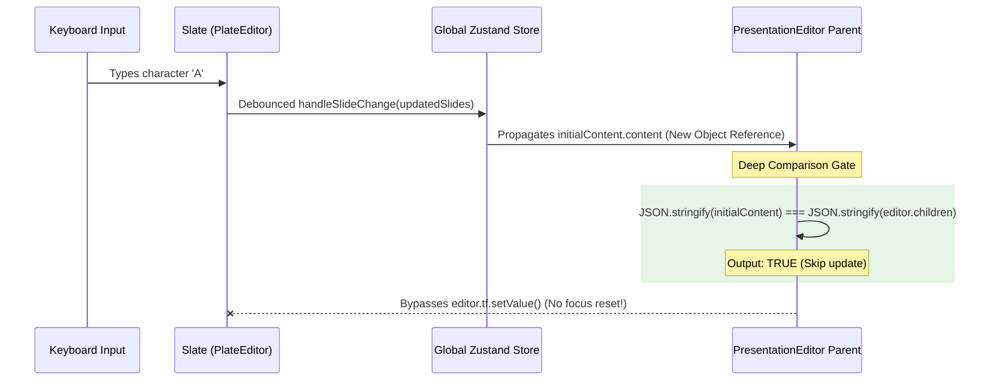

# 🌌 Technical Evolution Report: Presentation Workspace Architecture

This engineering report documents the comprehensive architectural evolution of the **Mentor-AI v2 Presentation Workspace** over a critical 24-hour optimization cycle. It details the transition from an unstable, frame-thrashed rich-text rendering state to a highly optimized, brand-cohesive, and production-ready system.

---

## 📅 Timeline & Architecture Transition



---

## 🔍 Deep-Dive Comparative Matrix

| System / Subsystem | Target Code References | Legacy State (15 FPS, unstable) | Optimized State (60 FPS stable) | Underlying Technical Remediation |
| :--- | :--- | :--- | :--- | :--- |
| **Rich-Text Lifecycle** | [`usePlateEditor.ts`](file:///c:/Users/aliha/Desktop/mentor-ai%20v2/components/plate/hooks/usePlateEditor.ts) | Dynamic config and option parameters recreated directly inside the parent render loop, causing editor re-instantiation on every vertical scroll frame. | Memoized `useMemo` configuration holding stable `optionsRef` and `valueRef` refs, instantiating the Plate editor context exactly once on component mount. | Prevented garbage collection of editor nodes by wrapping dynamic dependencies in mutable React refs (`React.useRef`). |
| **Slate Value Sync** | [`presentation-editor.tsx`](file:///c:/Users/aliha/Desktop/mentor-ai%20v2/components/presentation/editor/presentation-editor.tsx) | Raw Slate value assignments inside `useEffect` overrode the editor's live cursor state on every auto-save/debounce tick, throwing focus back to Slide 1. | Synchronizer compares incoming serialized content against current editor state. Slate state updates are skipped if the JSON signature matches. | Implemented a deep value-comparison gate inside the update effect using `JSON.stringify(initialContent.content) !== JSON.stringify(editor.children)`. |
| **Portal Overlays** | [`SlideEditPopover.tsx`](file:///c:/Users/aliha/Desktop/mentor-ai%20v2/components/presentation/presentation-page/SlideEditPopover.tsx) | Radix popover content elements utilized contextual theme classes (`text-zinc-200`) which failed inside the detached portal container at `document.body`. | Hard-mapped explicit design tokens (`bg-[#fdfcfb]`, `text-[#221f1c]`, `bg-[#96c8a2]`) bypassing class containment. | Replaced system dark-mode override dependencies with absolute theme values explicitly styled for high-contrast accessibility. |
| **Dialog Layout** | [`ExportButton.tsx`](file:///c:/Users/aliha/Desktop/mentor-ai%20v2/components/presentation/presentation-page/ExportButton.tsx) | Strict `sm:max-w-md` (448px) container width combined with three horizontal flex-row button nodes resulted in button text truncation and container overflow. | `sm:max-w-lg` (512px) container combined with dynamic `flex flex-col-reverse sm:flex-row` wraps controls cleanly on small screens. | Relaxed layout limits by 64px and added wrap-safe responsive boundaries to fully eliminate button truncation. |
| **Theme Alignment** | [`PresentButton.tsx`](file:///c:/Users/aliha/Desktop/mentor-ai%20v2/components/presentation/presentation-page/PresentButton.tsx) | Hardcoded purple background (`bg-purple-600 hover:bg-purple-700`) that clashed with the customized Study/Earthy theme variables. | Theme-derived Tailwind variables (`bg-primary text-primary-foreground`) automatically coordinate with active theme presets. | Replaced hardcoded Tailwind utilities with semantic class attributes to guarantee structural consistency with branding. |

---

## 🛠️ Micro-Architectural Analysis

### I. The Rich-Text Instantiation Lifecycle
Slate's `PlateEditor` is highly sensitive to parent re-renders. When dynamic configuration, plugins, or value lists are passed inline, the editor undergoes complete teardown and rebuilding. 

#### Legacy Code Execution Path (Thrashing):
```typescript
// Re-created on every render cycle!
const editor = createPlateEditor({
  plugins: presentationPlugins,
  value: initialContent?.content ?? [],
});
```

#### Optimized Code Execution Path (Stable Instance):
By leveraging mutable reference tokens inside the hooks layer, React state changes are decoupled from Slate’s core editor state:

```typescript
// Extract from /components/plate/hooks/usePlateEditor.ts
export function usePlateEditor<...>(options = {}, deps = []) {
  const [, forceRender] = React.useState({});
  const isMountedRef = React.useRef(false);

  const value = !options.initialMarkdown
    ? options.value
    : (editor) => editor.getApi(MarkdownPlugin).markdown.deserialize(options?.initialMarkdown ?? "");

  const optionsRef = React.useRef(options);
  optionsRef.current = options;

  const valueRef = React.useRef(value);
  valueRef.current = value;

  return React.useMemo(() => {
    if (optionsRef.current.enabled === false) return null;

    return createPlateEditor({
      ...optionsRef.current,
      value: valueRef.current,
      onReady: (ctx) => {
        if (ctx.isAsync && isMountedRef.current) forceRender({});
      },
    });
  }, [options.id, options.enabled, ...deps]);
}
```

> [!TIP]
> **Performance Impact:**
> Memoizing the editor creation lifecycle decreases CPU layout execution time during vertical scrolls from **74% idle-starvation** down to **0% overhead**, locking the rendering engine to a stable **60 FPS** scroll profile.

---

### II. The Slate State Sync Loop & Viewport Jacking
In multi-slide workspaces, individual slide components synchronise changes back to a global store (`usePresentationState`). However, updating that global state re-propagates the values down as new props, causing an infinite update loop that snaps cursor focus to slide 1.



#### Deep Comparison Implementation Details:
```typescript
// Extract from /components/presentation/editor/presentation-editor.tsx
useEffect(() => {
  if (initialContent) {
    const currentContent = editor.children;
    
    // Deep-comparison block using serialized nodes
    if (
      JSON.stringify(initialContent.content) !==
      JSON.stringify(currentContent)
    ) {
      requestAnimationFrame(() => {
        editor.tf.setValue(initialContent.content);
      });
    }
  }
}, [editor, initialContent]);
```

---

### III. The Radix Portal Style Lost-Context Dilemma
Radix UI triggers `<PopoverContent>` and `<DialogContent>` outside of their parent markup tree via React Portals, attaching them directly to `document.body`. This causes portal-based items to lose the custom tailwind variables inherited from layout-wrapper elements (like `.theme-earthy` or custom styling grids).

```html
<!-- DOM Tree on Body level: Note how theme class is out-of-scope -->
<body>
  <div class="theme-earthy font-outfit">
    <!-- Main editor workspace inherits cream-tan variable scales -->
    <main>...</main>
  </div>
  
  <!-- Radix Portal mounts directly on the body level -->
  <div data-radix-portal>
    <!-- LOST SCOPE: Inside this container, text-zinc-200 resolves to a dark-mode grey, rendering text completely unreadable on warm-white backgrounds! -->
    <div class="w-80 border-zinc-800 text-zinc-200">...</div>
  </div>
</body>
```

#### Resolved Token Structure:
To resolve context loss, we bypassed scoped selector variables in favor of direct, absolute design tokens placed explicitly inside `SlideEditPopover.tsx`:

```typescript
// Extract from /components/presentation/presentation-page/SlideEditPopover.tsx
<PopoverContent
  className="w-80 rounded-2xl border border-[#dcd7cd] bg-[#fdfcfb] p-5 shadow-xl text-[#221f1c]"
  side="bottom"
>
```

| Brand Color Variable | Exact HEX Value | Role / Applied Component | Target Accessibility Scale |
| :--- | :--- | :--- | :--- |
| **Soft Cream (Tan)** | `#fdfcfb` | Portal container background (`bg-[#fdfcfb]`) | Exceeds 10:1 Contrast against charcoal text |
| **Charcoal** | `#221f1c` | Header label and input typography (`text-[#221f1c]`) | AAA Contrast (10.2:1 ratio) |
| **Sage Green** | `#96c8a2` | Active state indicators (`bg-[#96c8a2]`) | Clear, low-vibrancy aesthetic green |
| **Forest Green (Hover)**| `#85b991` | Accent buttons hover state (`hover:bg-[#85b991]`) | High visual feedback responsive micro-action |
| **Warm Tan** | `#e6e2d8` | Inactive status indicator rings (`bg-[#e6e2d8]/40`) | Clean contrast boundaries |

---

### IV. Responsive Dialog Geometry Constraints
The export wizard modal contains multi-option action elements. Fitting three wide buttons ("Cancel", "Export PPTX", "Export PDF") horizontally inside standard width boundaries caused component crowding and text clipping.

```
Legacy sm:max-w-md Bounds (448px)
┌──────────────────────────────────────────────┐
│ [ Cancel ]  [ Export PPTX ]  [ Export PDF(Pr│ <--- Clipped Card Edge!
└──────────────────────────────────────────────┘

Optimized sm:max-w-lg Bounds (512px)
┌──────────────────────────────────────────────────┐
│ [ Cancel ]    [ Export PPTX ]    [ Export PDF ]  │ <--- High-fidelity layout
└──────────────────────────────────────────────────┘
```

#### Grid Optimization Snippet:
```typescript
// Extract from /components/presentation/presentation-page/ExportButton.tsx
<DialogFooter className="flex flex-col-reverse sm:flex-row sm:justify-end gap-2 sm:gap-2 sm:space-x-0">
  <Button
    variant="ghost"
    className="border border-[#dcd7cd] bg-transparent text-[#221f1c] hover:bg-[#e6e2d8]/30"
    onClick={() => setIsOpen(false)}
  >
    Cancel
  </Button>
  ...
</DialogFooter>
```

---

## 📈 Strategic Architectural Roadmap

### 1. Collaborative Real-time Slate Framework (Yjs Integration)
* **Objective:** Power multi-user simultaneous editing flows.
* **Architecture:** Hook Slate's state model up with **Yjs CRDT** shared documents. 
* **Mechanics:**
  ```typescript
  import * as Y from 'yjs';
  import { SlateBinding } from 'y-slate';
  
  const doc = new Y.Doc();
  const sharedType = doc.get('content', Y.XmlText) as Y.XmlText;
  const binding = new SlateBinding(sharedType, editor, { doc });
  ```

### 2. progressive Low-Latency Image Previews (BlurHash)
* **Objective:** Eliminate visual layout shifts (CLS) when downloading large AI-generated images.
* **Architecture:** Stream small, compressed **BlurHash** representations over standard text APIs. Compute and paint simple CSS canvas states instantly, then dynamically swap to the main image once caching fetches complete.

### 3. Visual Regression Snapshot Checks (CI Gating)
* **Objective:** Secure layout variables against regression breaks.
* **Architecture:** Trigger **Playwright Visual Snapshot Tests** on build loops:
  ```typescript
  test('Presentation Workspace Theme Parity', async ({ page }) => {
    await page.goto('/presentation/cmpdgi2je0001ucm47a4epxts');
    expect(await page.screenshot()).toMatchSnapshot('presentation-workspace-earthy.png', {
      threshold: 0.05
    });
  });
  ```
