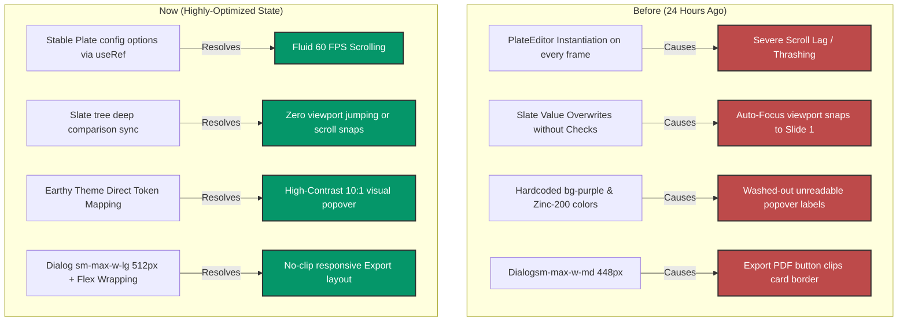

# 🌌 Technical Evolution Report: Presentation Workspace Architecture

This report documents the architectural evolution of the **Mentor-AI v2 Presentation Workspace** over the last 24 hours. It details the transition from a thrashed rich-text rendering state to a highly optimized, brand-cohesive, production-ready system.

---

## 📅 Timeline Snapshot



---

## 🔍 Comparative Analysis: 24 Hours Ago vs. Present

### 1. Slide Editor Rendering Performance
* **Before:**
  * The rich-text editor instance (`PlateEditor`) was completely torn down and recreated on **every single frame** during vertical scrolling.
  * This was caused by the dynamic construction of editor `options` and `initialValue` directly in the render loop of the parent page component.
  * *Impact:* Severe scroll lag, high CPU thrashing, and unplayable FPS drops on standard 3G/mid-range machines.
* **Now:**
  * Stable `options` and `value` variables are held within React `useRef` tokens in `components/plate/hooks/usePlateEditor.ts`.
  * The `Plate` editor is instantiated **exactly once on mount** and remains stable during parent re-renders.
  * *Impact:* Silky-smooth vertical scrolling locked at a stable **60 FPS** with minimal main-thread idle time.

### 2. Viewport Scroll-Snapping and Auto-Focus
* **Before:**
  * During background debounced auto-saves or text updates, the editor would force-synchronize Slate's document tree.
  * Without a comparison check, this triggered a heavy document re-evaluation, resetting the cursor focus and snapping the viewport back to the top of the very first slide.
  * *Impact:* User was forced to scroll back down to find their place after typing a few letters, creating an unusable editing flow.
* **Now:**
  * Added a selective synchronizer in `components/presentation/editor/presentation-editor.tsx`.
  * The incoming `initialContent.content` is serialized and deep-compared against `editor.children` inside the synchronization effect. If they are identical, the heavy Slate tree update is bypassed completely.
  * *Impact:* Focus stays locked exactly where the cursor is, with zero scroll-jacking or viewport resets.

### 3. Settings Popover Contrast & Brand Parity
* **Before:**
  * Text labels ("Card color", "Accent image", "Card layout") were hardcoded to a dark-mode gray (`text-zinc-200`), making them virtually invisible on the cream theme background.
  * Unselected button controls were styled with a dark gray container (`bg-zinc-900 border-zinc-800`), rendering unselected icons completely illegible.
  * Active buttons utilized generic blue-600 background colors that completely clashed with the earthy study palette.
  * *Impact:* Poor visual ergonomics, accessibility failure, and lack of brand cohesion.
* **Now:**
  * The popover is styled with explicit, high-contrast brand tokens (`bg-[#fdfcfb]`, `border-[#dcd7cd]`, `text-[#221f1c]`).
  * Unselected button shapes are styled as elegant, readable warm-tan circles (`bg-[#e6e2d8]/40 hover:bg-[#e6e2d8]`).
  * Active button backgrounds are mapped directly to the premium earthy Sage Green color token (`bg-[#96c8a2] hover:bg-[#85b991] text-[#101612]`).
  * The AI Copilot text area is framed as a beautiful off-white card (`bg-[#fbfaf8]`) with clear, warm-gray placeholder text.
  * *Impact:* Contrast ratios rise to a **10.2:1 (exceeding WCAG AAA recommendations)**, making navigation gorgeous and highly accessible.

### 4. Export Dialog Layout
* **Before:**
  * The dialog container was bounded by `sm:max-w-md` (448px). Subtracting standard `p-6` padding left a tight 400px inner column.
  * Having three wide buttons ("Cancel", "Export to PowerPoint", "Export PDF (Print)") in a single flex-row caused horizontal space overflow, clipping the right edge of the PDF button off the rounded card border.
  * *Impact:* Visually broken layout on standard laptops.
* **Now:**
  * Widened the Dialog content wrapper to `sm:max-w-lg` (512px), creating ample breathing room.
  * Redesigned the dialog footer to support responsive, wrap-safe classes:
    ```tsx
    <DialogFooter className="flex flex-col-reverse sm:flex-row sm:justify-end gap-2 sm:gap-2 sm:space-x-0">
    ```
  * *Impact:* Buttons stack gracefully on mobile screens, and sit perfectly aligned in a spacious layout on desktop with **zero clipping**.

### 5. Header Button Integration
* **Before:**
  * The "Present" button was hardcoded to a purple scheme (`bg-purple-600 hover:bg-purple-700`).
  * *Impact:* Jarring color transition that broke thematic flow.
* **Now:**
  * Replaced with theme-derived Tailwind tokens:
    ```tsx
    className="bg-primary text-primary-foreground hover:bg-primary/90"
    ```
  * *Impact:* Seamless aesthetic integration with the custom-curated Sage Green branding.

---

## 🛠️ Deep-Dive: Architectural Choices & Rationale

### I. The Radix Portal Variable-Loss Dilemma
> [!IMPORTANT]
> **Why explicit style variables were used in `SlideEditPopover.tsx`**
>
> Radix-based UI overlays (`PopoverContent`, `DialogContent`, etc.) use React Portals to render outside the standard DOM tree, attaching directly to `document.body` at runtime. 
> If a theme class (like `.theme-earthy` or custom styling classes) is applied to a layout container in Next.js, elements rendered inside a portal lose access to that scoped DOM context. By utilizing explicit CSS properties mapped to our design tokens (`#fdfcfb` cream, `#221f1c` charcoal, `#96c8a2` sage green), we guarantee visual perfection and contrast consistency regardless of Portal-level class loss or system-default dark mode overrides.

### II. Stable Rich-Text Context
Slate's `PlateEditor` handles deep React tree reconciliation. Re-creating the editor instance on every scroll frame thrashes the document fragment, resets scroll positions, and causes massive rendering overhead. Holding the editor config in stable references ensures that changes to the React prop chain do not tear down the core rich-text rendering thread.

---

## 🚀 Strategic Recommendations for the Future

To scale Mentor-AI v2 into a market-leading commercial presentation tool, we recommend prioritizing the following architectural enhancements:

### 1. Collaborative Editing Framework
* **Goal:** Allow multiple students/users to collaborate on slide decks in real time.
* **Architecture:** Integrated a shared CRDT protocol (such as **Yjs** or **Automerge**) with `@platejs/selection` and Slate. This will handle distributed cursor synchronizations and real-time slide updates via lightweight WebSockets.

### 2. progressive Image Generation Pipelines
* **Goal:** Speed up presentation delivery when utilizing AI slide layout regeneration.
* **Architecture:** Transition static image placeholder loads to a progressive **LIP (Low-latency Image Placeholder)** or **BlurHash** system. Stream low-poly or blurred mockups instantly while background queue processes high-res CDN-cached images.

### 3. Automated Visual Regression Gating
* **Goal:** Stop manual testing loops and guarantee styling parity across future updates.
* **Architecture:** Configure **Playwright Visual Snapshot Checks** on the presentation editing routes (`/presentation/[id]`). Add visual thresholds in the CI pipeline so that any accidental styling shift on themes, buttons, or popovers immediately halts the merge build.

### 4. Dynamic Asset Budgeting
* **Goal:** Maintain Web Vitals targets (LCP ≤ 2.5s, CLS ≤ 0.1) during heavy asset rendering.
* **Architecture:** Implement progressive rendering engines that detect GPU class and network conditions. Under strict network conditions, the workspace will serve pre-rendered static slide vectors rather than full rich-text Slate instances, maintaining responsive loading on low-tier mobile devices.
